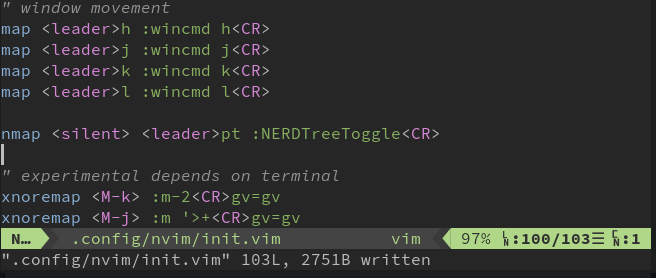

# Vim-Configuration

The vim-configuration in this repo is a combination of Features (functionality added by using buildin capabilities) and Plugins (functionality added by using externall repos with corespondig vim-skripts for extensions)

- Features
    - Functionality added by using buildin capabilities.
- Plugins
    - Functionality added by using externall repos with corespondig vim-skripts for extensions.

## Features

Features are ment to be compatible with with standard-vim (vim and neovim for example). You should be able to place the corresponding Vim-Skript-Snippets for your desired functionalities and place them into your `.vimrc` to have them working right away.

### Linemovement

In `normal` or `visual` mode one can use the keys
- `<Mod>+j` to move the selected lines one **down**
- `<Mod>+k` to move the selected lines on **up**



```vim
" experimental depends on terminal
xnoremap <M-k> :m-2<CR>gv=gv
xnoremap <M-j> :m '>+<CR>gv=gv
```

## Plugins

#todo
